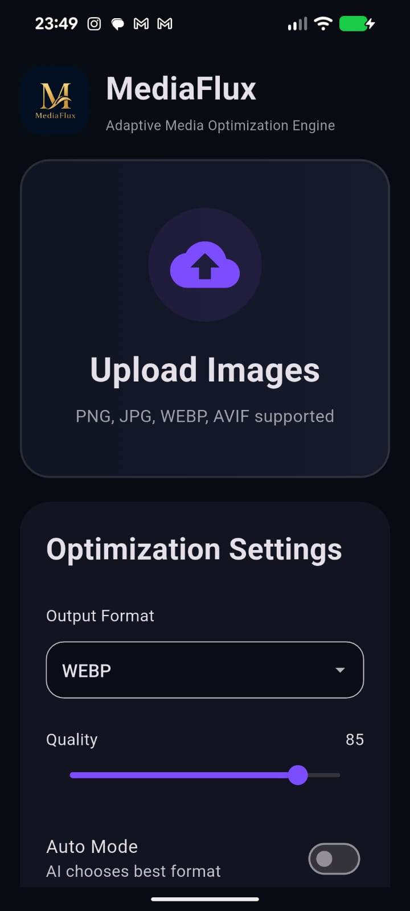
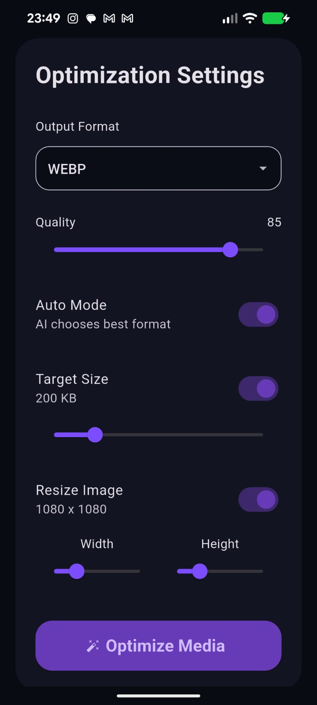
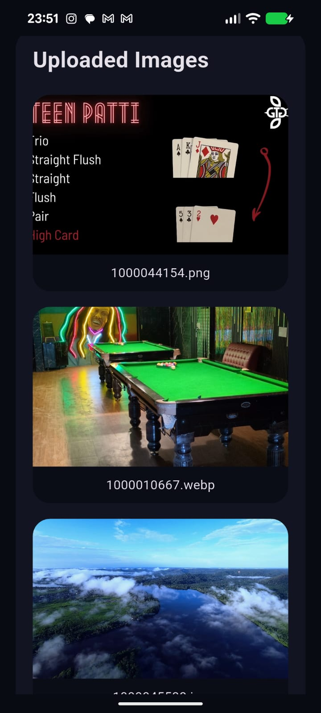
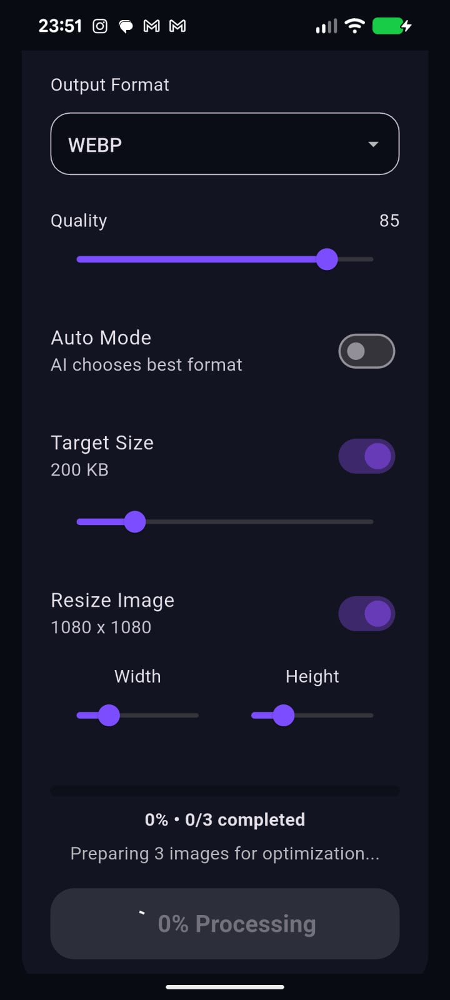
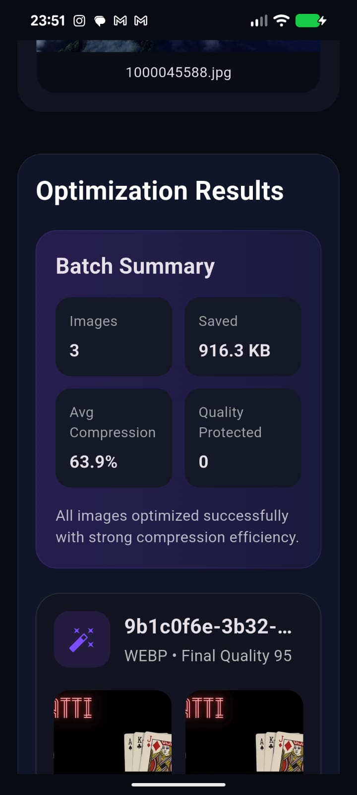
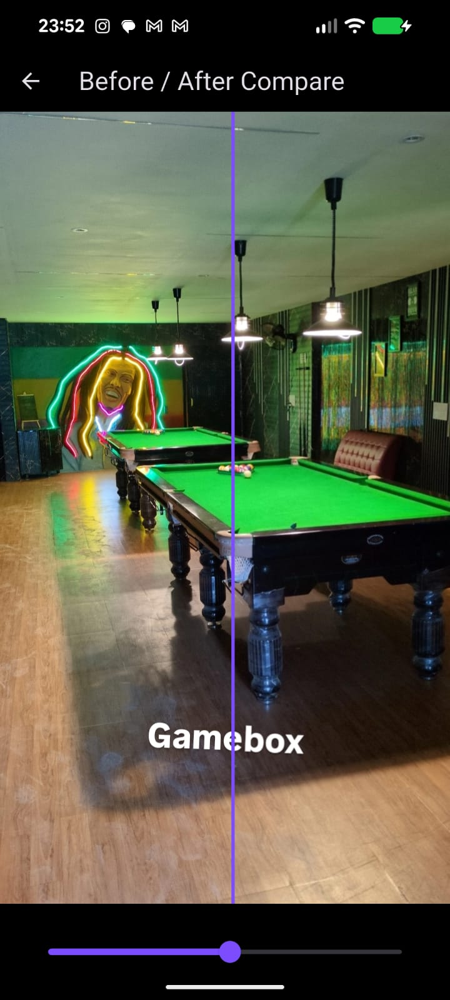
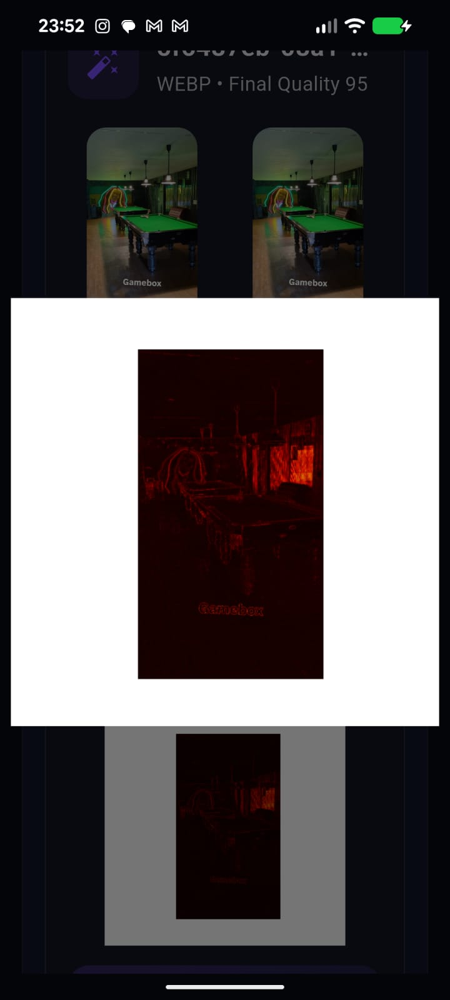
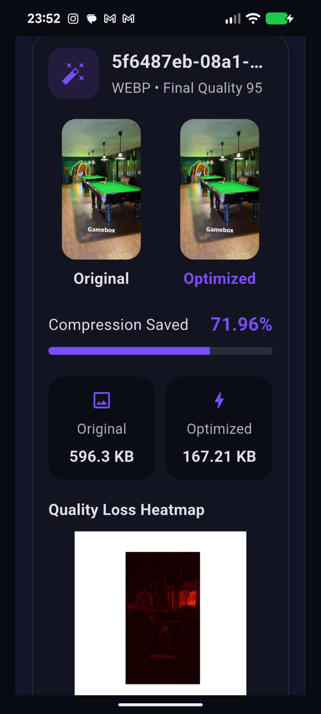
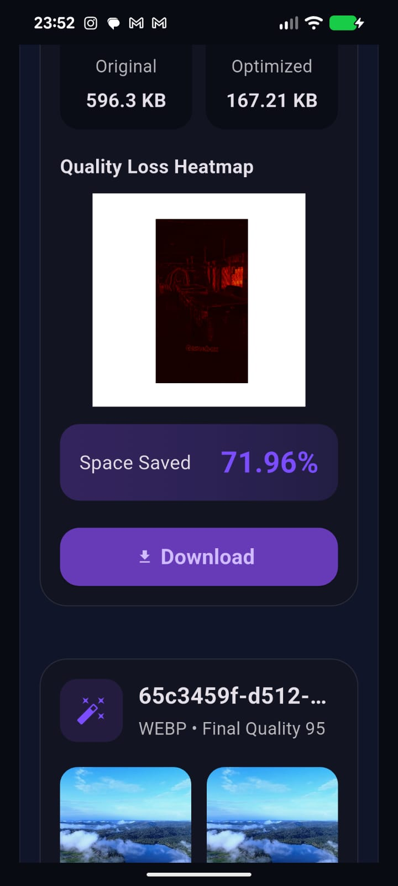

# 🚀 MediaFlux
### AI-Powered Adaptive Media Optimization Platform


MediaFlux is a full-stack AI-powered media optimization platform built using **Flutter** and **FastAPI**.

The platform intelligently:

- Compresses images
- Converts formats
- Generates heatmaps
- Tracks real-time optimization progress
- Creates comparison previews
- Supports adaptive optimization workflows

Built with a production-style architecture featuring:

- Async backend processing
- Progressive result rendering
- Real-time polling systems
- Threaded optimization pipelines
- Premium responsive UI

---

# 📲 Download APK

## Latest Release

👉 [Download MediaFlux APK](https://github.com/VenCasMet/appbackendmediaflux/releases/download/v1.0/app-release.apk)

---

⚠️ Since the app is distributed outside Play Store:

- Enable **Install from Unknown Sources**
- Android may show a security warning
- This is normal for GitHub-distributed APKs

---

# ✨ Features

## 🔥 Core Features

- Multi-image batch uploads
- Intelligent image optimization
- Adaptive compression engine
- Real-time optimization progress
- Heatmap generation
- Before/After comparison system
- Progressive result rendering
- Auto-scroll live UI updates
- Smart batch summaries
- Download optimized media directly
- Responsive premium UI
- Multi-format conversion support

---

# 🖼 Supported Formats

## Input Formats

- PNG
- JPEG
- WEBP

## Output Formats

- WEBP
- AVIF
- JPEG
- PNG

---

# 🧠 Intelligent Optimization Engine

MediaFlux includes an adaptive optimization system capable of:

- Automatic format selection
- Dynamic compression strategies
- Quality-preservation prioritization
- Target-size optimization
- Smart resize workflows

The optimization engine attempts to preserve visual quality while maximizing storage reduction.

---

# ⚡ Real-Time Processing System

MediaFlux implements a production-style asynchronous processing architecture.

##  Optimization Stages

| Progress | Stage |
|----------|--------|
| 10% | Loading |
| 25% | Preparing |
| 50% | Converting |
| 70% | Analyzing |
| 85% | Heatmap Generation |
| 92% | Comparison Rendering |
| 100% | Completed |

---

# 🎯 Progressive Rendering Architecture

Unlike traditional batch-processing systems, MediaFlux streams results progressively.

## Workflow

```text
Upload Images
↓
Backend Processes Asynchronously
↓
Each Completed Result Updates Instantly
↓
Frontend Polling Detects Update
↓
Result Card Renders Immediately
↓
UI Auto-Scrolls To Latest Result
```

This creates:

- Continuous visual feedback
- Better responsiveness
- Improved perceived performance
- Modern async UX experience

---

# 🧩 System Architecture

# 📱 Frontend — Flutter

## Responsibilities

- Image selection
- Upload handling
- Polling backend jobs
- Real-time UI updates
- Rendering optimization results
- Download system
- Comparison rendering
- Animated progress system

## Major Packages Used

```yaml
image_picker
http
dio
before_after
path_provider
permission_handler
url_launcher
flutter_launcher_icons
flutter_native_splash
gal
flutter_animate
```

---

# ⚙️ Backend — FastAPI

## Responsibilities

- Upload handling
- Job creation
- Threaded processing
- Progress synchronization
- Media optimization
- Heatmap generation
- Comparison generation
- Cleanup lifecycle management

## Core Technologies

```python
FastAPI
Pillow
Uvicorn
Threading
Concurrent Futures
StaticFiles
```

---

# 🏗 Backend Processing Pipeline

```text
Flutter Uploads Images
↓
FastAPI Creates Batch Job
↓
Background Thread Starts
↓
Conversion Manager Processes Images
↓
Progress Callback Updates Registry
↓
Flutter Polls Every 300ms
↓
Live Progress UI Updates
↓
Results Render Incrementally
↓
User Downloads Optimized Media
```

---

# 🔄 Real-Time Progress Synchronization

One of the major architectural improvements in MediaFlux was implementing a live progress synchronization system.

## Final Architecture

```text
ProgressTracker.update()
↓
progress_callback(job)
↓
JobRegistry.update_job()
↓
Frontend Polling
↓
setState()
↓
Live Progress UI
```

This solved the major issue where progress remained stuck until completion.

---

# 🖥 UI/UX Highlights

## Premium Design System

- Dark premium theme
- Purple-accent visual identity
- Modern card layouts
- Glass-style aesthetics
- Responsive layouts
- Animated result cards
- Smooth progressive rendering

---

# 📊 Heatmap Analysis System

MediaFlux generates visual heatmaps showing:

- Compression intensity regions
- Pixel quality differences
- Optimization impact areas

These heatmaps help users visually analyze optimization quality.

---

# 🆚 Comparison System

The platform automatically generates:

- Side-by-side comparisons
- Before/After visual previews
- Compression quality previews

Users can visually inspect optimization results instantly.

---

# 📦 Smart Batch Summary

After processing completes, MediaFlux generates intelligent batch summaries.

## Example

```text
12 Images Optimized
48 MB Saved
Average Compression: 67%
```

The system also provides optimization insights and quality-preservation explanations.

---

# 🧹 Temporary Storage Lifecycle System

MediaFlux includes production-style cleanup architecture.

## Backend Strategy

```text
1 Request
=
1 Temporary Workspace
=
Deleted After Completion
```

## Features

- Temporary request folders
- Background cleanup workers
- Safe file lifecycle management
- Automatic temp cleanup
- Storage-safe VPS architecture

---

# 🚀 Deployment

## Backend Deployment

- Replit Deployment

## Planned Infrastructure Upgrades

- Oracle Cloud VPS
- Dedicated production hosting
- Improved concurrent processing

---

# 📁 Project Structure

```text
MediaFlux/
│
├── api/
├── converters/
├── core/
├── mediaflux_app/
├── reports/
├── utils/
│
├── main.py
├── requirements.txt
├── README.md
└── .gitignore
```

---

# ⚙️ Installation

## 1️⃣ Clone Repository

```bash
git clone https://github.com/VenCasMet/appbackendmediaflux.git

cd appbackendmediaflux
```

---

## 2️⃣ Frontend Setup (Flutter)

```bash
cd mediaflux_app

flutter pub get

flutter run
```

---

## 3️⃣ Backend Setup (FastAPI)

```bash
pip install -r requirements.txt

uvicorn main:app --host 0.0.0.0 --port 8000
```

---

# 📡 API Workflow

## Upload Images

```http
POST /upload
```

### Includes

- Image files
- Quality settings
- Resize settings
- Target size settings
- Output format

---

## Poll Job Status

```http
GET /job/{job_id}
```

### Example Response

```json
{
  "progress": 50,
  "current_stage": "converting"
}
```

---

# 🧠 Engineering Highlights

MediaFlux implements:

- Client-server architecture
- Threaded backend execution
- Asynchronous job processing
- Polling-based synchronization
- Progressive frontend rendering
- Real-time state propagation
- Adaptive optimization pipelines
- Temporary storage lifecycle management

---

# 📈 Major Technical Learnings

## Flutter

- Async state handling
- Polling systems
- Responsive UI architecture
- APK generation
- Plugin integration
- Download systems

## Backend

- FastAPI deployment
- Threaded processing
- Job registries
- Progress synchronization
- Cleanup lifecycle systems
- Production debugging

---

# 🔮 Future Roadmap

## Planned Features

- Video optimization support
- AV1 / HEVC workflows
- AI quality prediction
- Smarter adaptive heuristics
- User accounts
- Cloud synchronization
- Optimization history
- Premium processing tiers
- Play Store production release

---

# 🏆 Current Status

✅ Fully working Flutter frontend

✅ Public FastAPI backend deployment

✅ Multi-format optimization

✅ Real-time progress tracking

✅ Progressive rendering architecture

✅ Heatmap generation

✅ Comparison generation

✅ Download system

✅ Batch optimization workflows

✅ Responsive premium UI

✅ Production-style backend architecture

---

# 📸 Screenshots

## 🏠 Home Screen



---

## ⚙️ Optimization Settings



---

## 🖼 Uploaded Images



---

## 🎛 Optimization Configuration



---

## 📊 Batch Optimization Results



---

## 🔍 Before / After Comparison



---

## 🌡 Quality Loss Heatmap



---

## 📈 Compression Analytics



---

## 💾 Download System



---

# 🤝 Contributing

Contributions, ideas, and improvements are welcome.

Feel free to fork the repository and open pull requests.


---

# 👨‍💻 Developer

Built by **Piyush Sharma**

MediaFlux evolved from an experimental optimization idea into a production-style asynchronous media optimization platform focused on performance, UX psychology, and intelligent compression workflows.
